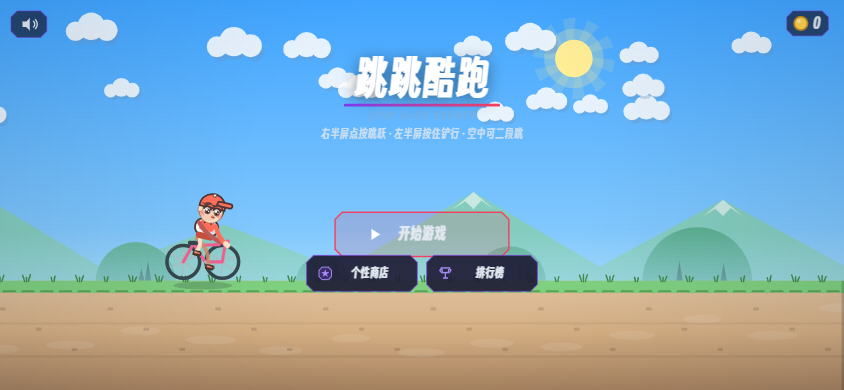
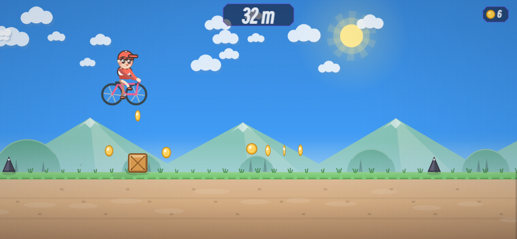
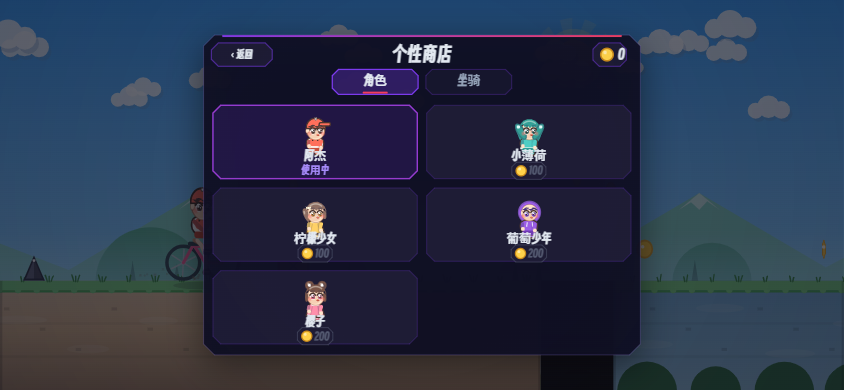

# 跳跳酷跑 🏃‍♂️🚲

一款用**原生 Canvas** 从零绘制的微信小游戏——零图片、零音频素材，全部画面与音效由代码实时生成。



## ✨ 特色

- 🎮 **双区操作**：右半屏点按跳跃（二段跳），左半屏按住铲行——天天酷跑式两键完成全部操作
- 🚲 **坐骑系统**：自行车（初始赠送）、小马驹、小摩托、小恐龙，各有专属特权，还能替你挡一次撞击
- 👦 **可爱角色**：5 个 Q 版小人（棒球帽/双马尾/马尾辫/连帽卫衣/丸子头），胶囊肢体+渐变体积渲染
- 🌅 **昼夜循环**：正午 → 黄昏 → 深夜 → 清晨，每 300 米切换时段，星空、月亮、雪山、轮廓光
- 🛡 **道具**：护盾挡撞击、磁铁吸金币（自行车磁铁时间 +50%）
- 🛒 **个性商店**：金币解锁角色与坐骑，本地存档
- 🏆 **排行榜**：微信好友榜（开放数据域）+ 本地 Top8 记录
- 🔊 **合成音频**：背景音乐与全部音效由 WebAudio 振荡器实时合成

## 🎮 玩法



| 障碍 | 应对 |
| --- | --- |
| 尖刺 / 木箱 | 跳过 |
| 深坑 | 跳跃 / 二段跳 |
| 低空飞鸟 | 铲行穿过，或看准时机跳过 |
| 无人机广告牌 | 只能铲行通过 |
| 绿色平台箱 | 从上方落下可站上箱顶（顶上有金币） |

| 坐骑 | 特权 | 售价 |
| --- | --- | --- |
| 步行 | 轻装上阵 | 免费 |
| 小马驹 | 跳跃高度 +8% | 150 金币 |
| 自行车 🎁 | 磁铁时间 +50% | **初始赠送** |
| 小摩托 | 速度 +8% | 300 金币 |
| 小恐龙 | 开局自带护盾 | 300 金币 |

## 🖼 更多截图



## 🚀 运行

**微信开发者工具**：导入 `jump-runner/` 目录，AppID 选「测试号」即可编译运行（横屏游戏）。

**浏览器实时预览**（改代码刷新即见）：

```bash
node dev-preview/server.js
# 打开 http://localhost:8791
```

## 🧪 测试

无头自动化测试：状态机、碰撞、道具效果、商店经济、存档迁移、AI 自动试玩与压力测试。

```bash
node test/run.js   # 81 项断言
```

## 📁 结构

```
jump-runner/          # 小游戏本体（导入微信开发者工具）
├── game.js           # 入口
├── openDataContext/  # 好友排行榜开放数据域
└── js/               # 11 个模块（详见 jump-runner/README.md）
dev-preview/          # 浏览器预览辅助
test/                 # 无头测试
```

详细玩法、调参指南与字体/排行榜配置说明见 [jump-runner/README.md](jump-runner/README.md)。
